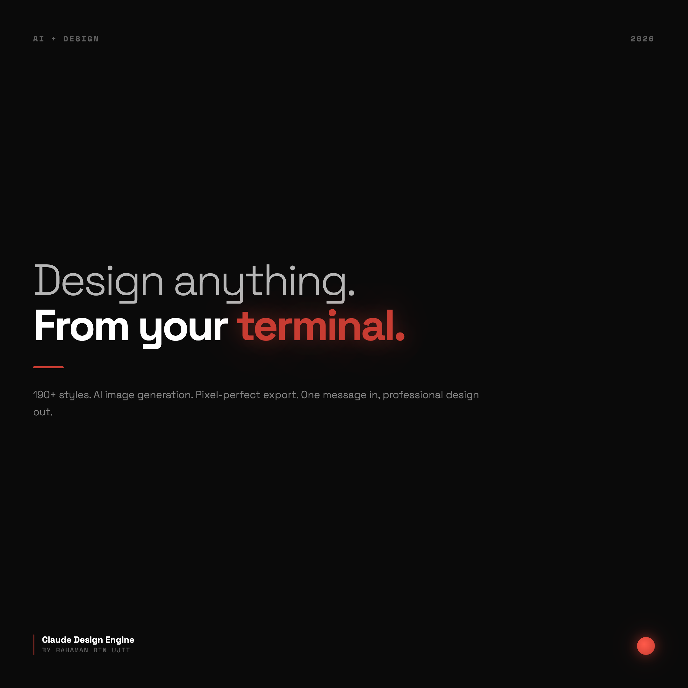
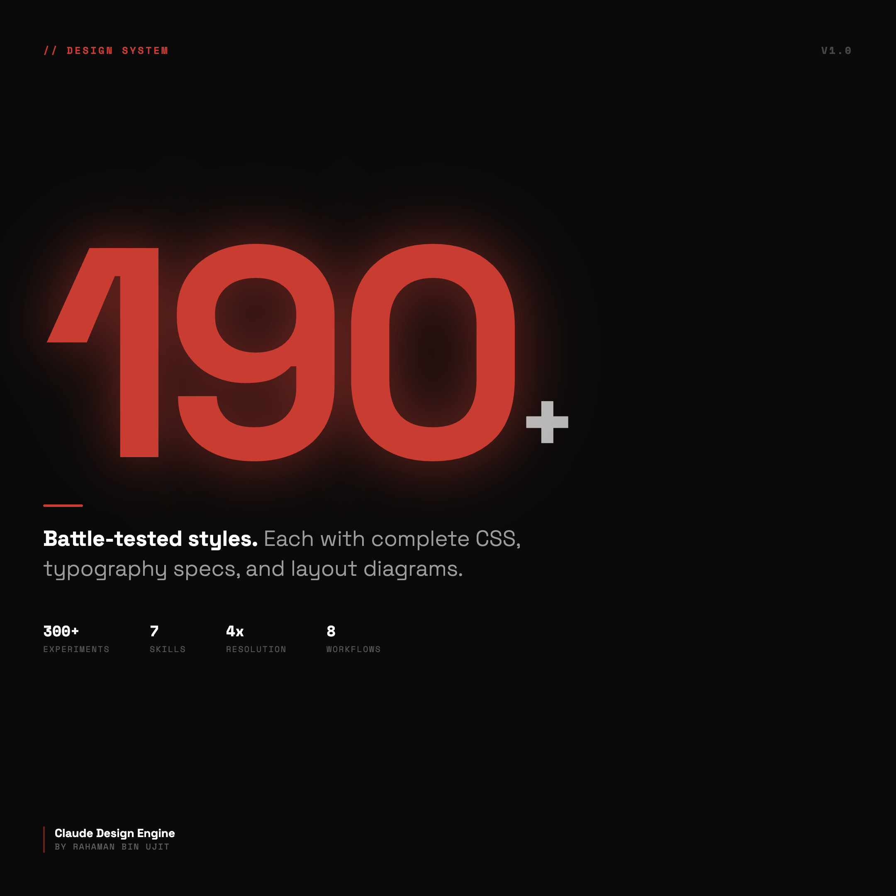
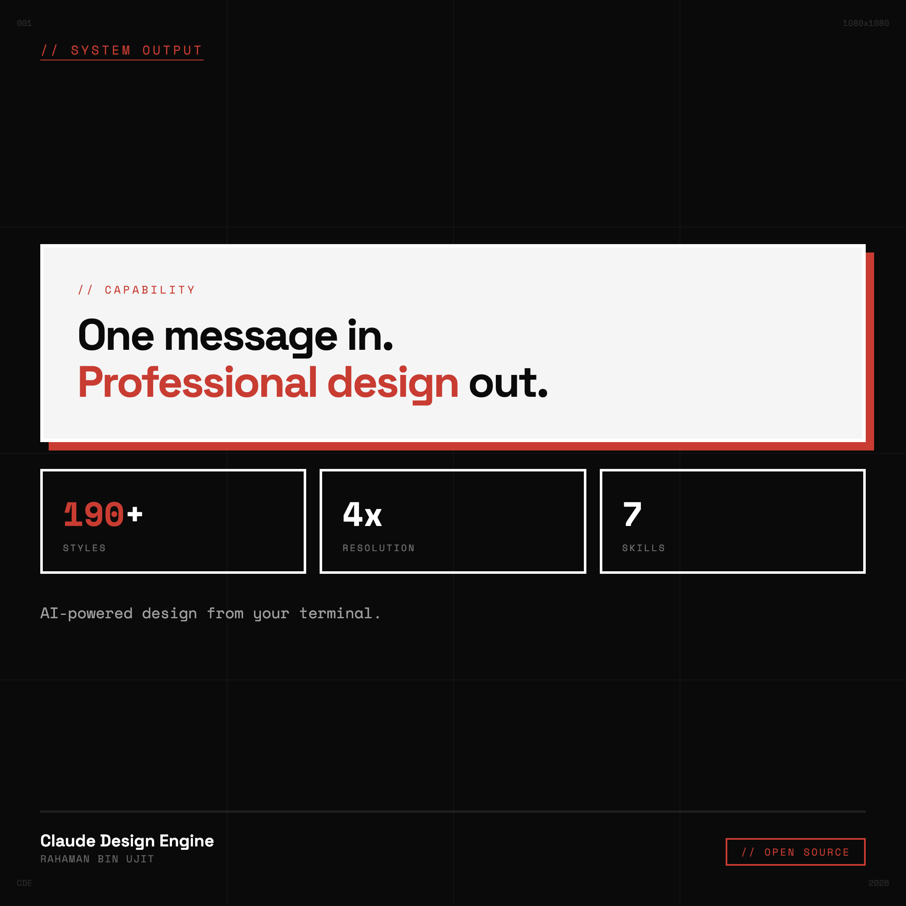

<!-- Claude Design Engine -->

<div align="center">

# Claude Design Engine

### Turn Claude Code into a professional graphic designer.

**190+ design styles. AI image generation. Pixel-perfect export. Your brand, your rules.**

[](LICENSE)
[](styles/INDEX.md)
[](https://www.linkedin.com/in/rahamanbinujit/)

---

*Built through 300+ real design experiments. Every style tested, scored, and validated.*

</div>

---

## Example Output

These were generated entirely by the design engine — one prompt each, zero manual editing:

<div align="center">
<table>
<tr>
<td></td>
<td></td>
<td></td>
</tr>
<tr>
<td align="center"><em>Type Hero Style</em></td>
<td align="center"><em>Minimaximalist Style</em></td>
<td align="center"><em>Neo-Brutalist Style</em></td>
</tr>
</table>
</div>

> 3 of 190+ styles. Each produces a different aesthetic from the same system.

---

## What Can It Do?

| Capability | Description |
|---|---|
| **Social Media Posters** | LinkedIn, Instagram, Twitter/X — square (1080x1080) or portrait (1080x1350) |
| **Carousels** | Multi-slide PDF or PNG carousels with consistent branding across slides |
| **YouTube Thumbnails** | High-contrast, scroll-stopping 1280x720 thumbnails |
| **Websites & Landing Pages** | Full responsive websites, landing pages, portfolios, link-in-bio pages |
| **PDF Documents** | Reports, presentations, multi-page documents with professional layout |
| **AI Photo Generation** | Generate professional photos using Gemini AI, embed them into designs |
| **AI Photo Editing** | Remove backgrounds, change lighting, style transfer on any image |
| **Brand Consistency** | Every design automatically uses YOUR fonts, YOUR colors, YOUR identity |
| **190+ Layout Styles** | From neo-brutalist to botanical illustration — each with complete CSS |
| **Self-Review System** | AI scores every design (1-5) and fixes issues before showing you |
| **4x Resolution Export** | 4320x4320px output that survives any platform's compression |
| **7 Design Skills** | Typography, layout, color, hierarchy, CSS, photo integration — all teachable |

---

## How It Works

You talk to Claude. Claude designs.

```
You:    "Design a LinkedIn post about AI replacing marketing teams"

Claude: 1. Loads your brand (fonts, colors, identity)
        2. Researches real reference designs in that niche
        3. Picks 'bold-split' style from the 190+ library
        4. Generates a comparison photo using AI (Gemini)
        5. Builds the layout in HTML/CSS with your brand
        6. Self-reviews: scores 4.5/5 ✓
        7. Exports at 4x resolution (4320x4320px PNG)
        8. Opens the image for you

Total: One message in, professional design out.
```

### The Design Pipeline

```
Brief → Research → Style Selection → AI Photos → HTML/CSS Build → Self-Review → Export
```

Every step is automated. Every step follows rules refined through 300+ experiments.

---

## Quick Start

### Install as a Skill (Recommended)

**Claude Code:**
```bash
claude skill install github:rahamanujit/claude-design-engine
```

**Or clone manually:**
```bash
git clone https://github.com/rahamanujit/claude-design-engine.git
cd claude-design-engine/scripts && npm install
```

**Then add to your `CLAUDE.md`:**
```markdown
## Design System
For any design task, read and follow `claude-design-engine/SKILL.md`.
```

### Works With Other Agents Too

| Agent | How to Install |
|---|---|
| **Claude Code** | `claude skill install github:rahamanujit/claude-design-engine` |
| **Cursor** | Clone → configs auto-detected in `.cursor/skills/` |
| **Codex CLI** | Clone → configs auto-detected in `.codex/` |
| **Gemini CLI** | Clone → configs auto-detected in `.gemini/` |
| **SkillKit** | `skillkit install rahamanujit/claude-design-engine` |

### Set Up AI Image Generation (Optional)

Add the nano-banana MCP server for Gemini-powered photo generation:

```json
{
  "mcpServers": {
    "nano-banana": {
      "command": "npx",
      "args": ["-y", "nano-banana@latest"]
    }
  }
}
```

Get a free API key from [Google AI Studio](https://aistudio.google.com/apikey). **Your key stays local — never committed to git.**

### Design Something

```
"Design a LinkedIn post about [your topic]"
"Build me a landing page for my SaaS product"
"Create a YouTube thumbnail for my video about AI"
```

First time, it asks 7 questions about your brand. After that, every design uses your brand automatically.

---

## The 190+ Style Library

Every style is a complete design template with:
- ASCII layout diagram showing exact element placement
- Full CSS implementation (copy-paste ready)
- Typography specs (font sizes, weights, spacing)
- Color application rules
- When to use / when not to use

### Sample Styles

| Style | Best For | Vibe |
|---|---|---|
| **Bold Split** | Comparison posts, before/after | Dark editorial with dual photo panels |
| **Type Hero** | Thought leadership, quotes | Typography-dominant, vast whitespace |
| **Bento Grid** | Stats, multi-point content | Apple-style modular grid |
| **Minimaximalist** | Single powerful stat | One element at 420px, everything else tiny |
| **Neo-Brutalist** | Tech/systems content | White cards, hard red shadows, terminal feel |
| **Newspaper Masthead** | Breaking news, announcements | Retro editorial broadsheet |
| **Torn Paper Edge** | Authentic, personal content | Organic, handmade collage |
| **Neon Noir** | Futuristic/tech content | Glowing accents on deep black |
| **Botanical Illustration** | Growth/patience narratives | Herbarium specimen aesthetic |
| **Architectural Blueprint** | Systems thinking content | Technical floor plan poster |
| **Art Deco** | Premium announcements | 1920s geometric elegance |
| **Tarot Card** | Mystical/identity posts | Illustrated card with symbolism |
| **Cassette Mixtape** | Nostalgia, personal journey | 80s/90s tape J-card insert |
| **Data Journalism** | Data-driven insights | Infographic editorial layout |
| **Forensic Evidence Board** | Investigation/deep-dive posts | Red string conspiracy board |

**...and 175+ more.** Browse the full library: [`styles/INDEX.md`](styles/INDEX.md)

---

## AI Image Generation

The hybrid workflow that makes this system unique:

```
AI generates the photos  →  Code controls the layout  →  Best of both worlds
```

**Powered by Google Gemini via [nano-banana](https://github.com/anthropics/nano-banana) MCP server.**

### What You Can Generate

| Capability | Example Prompt |
|---|---|
| **Professional headshots** | *"Studio headshot, 85mm f/1.4, warm softbox lighting"* |
| **Product photography** | *"Laptop on dark surface, dramatic rim lighting, red accent"* |
| **Lifestyle scenes** | *"Marketer in modern office, golden hour, candid style"* |
| **Abstract backgrounds** | *"Dark gradient with subtle noise, navy to black"* |
| **Background removal** | Edit any photo to remove/change backgrounds |
| **Style transfer** | Apply reference image styles to your photos |
| **Iterative editing** | *"Make it warmer" → "Add more contrast" → "Perfect"* |

The AI generates photos. You control everything else: typography, layout, spacing, brand colors, composition. No more fighting with AI to get text right.

---

## The Quality System

Every design is scored before you see it.

```
Score 5  ████████████████████  Exceptional — would stop someone scrolling
Score 4  ████████████████      Professional — clean, well-executed
Score 3  ████████████          Acceptable — needs fixes before showing
Score 2  ████████              Below standard — must fix
Score 1  ████                  Broken — start over
```

**Minimum score to show you: 4.** The system fixes issues automatically before presenting.

### What It Checks
- Text readability (can you read it on a phone?)
- Visual hierarchy (is there ONE clear focal point?)
- Alignment (is everything on the grid?)
- Color usage (accent on ONE element only?)
- Spacing (consistent padding, breathing room?)
- Brand consistency (matches your config?)
- Overall composition (would you be proud of this?)

---

## Design Skills Included

The engine doesn't just produce designs — it teaches design thinking. Every skill is a standalone guide with techniques, code examples, and practice exercises.

| Skill | What You'll Learn |
|---|---|
| **[Typography Mastery](skills/typography-mastery.md)** | Weight contrast, the 4:1 hierarchy rule, letter-spacing inversion, accent words, font pairing |
| **[Layout & Composition](skills/layout-composition.md)** | The 3-zone system, 8px grid, focal points, whitespace as design, flexbox for everything |
| **[Color Application](skills/color-application.md)** | One-accent rule, opacity-based hierarchy, warm neutrals, glow techniques, palette construction |
| **[Visual Hierarchy](skills/visual-hierarchy.md)** | Size dominance, the squint test, 4 levels of importance, reading flow, format-as-punchline |
| **[CSS for Designers](skills/css-for-designers.md)** | Essential CSS patterns: flexbox, grid, cards, pills, gradients, clip-paths, Google Fonts |
| **[Photo Integration](skills/photo-integration.md)** | Hybrid workflow, photo panels, cutouts, custom shapes, AI prompt formulas for cinematic photos |
| **[Website Design](skills/website-design.md)** | Landing pages, responsive grids, nav patterns, section flow, fluid typography, CTA hierarchy |

These skills are automatically applied during design. But you can read them to understand the "why" behind every decision, or to develop your own design eye.

---

## Why HTML/CSS?

| Approach | Problem |
|---|---|
| AI image generation (DALL-E, Midjourney) | Can't control text, layout, or brand consistency |
| Canva/Figma templates | Requires manual work, limited by templates |
| Direct PDF libraries (jsPDF, pdfkit) | Poor typography, alignment nightmares |
| Markdown to PDF | No design control, generic look |
| **HTML + CSS + Puppeteer** | **Full CSS control. Pixel-perfect. Programmable. Your brand.** |

HTML/CSS gives you:
- Exact control over every pixel
- Google Fonts with proper rendering
- Flexbox/Grid for perfect alignment
- 4x resolution export via Puppeteer
- Reproducible, version-controllable designs

---

## What's Inside

```
claude-design-engine/
│
├── CLAUDE.md                     ← The brain. Powers the entire system.
├── brand.config.json             ← YOUR brand (auto-generated on first run)
├── LICENSE                       ← Copyright Rahaman Bin Ujit
│
├── onboarding/                   ← First-time brand setup
│   └── setup.md                  ← 7 questions → your brand config
│
├── workflows/                    ← Step-by-step design processes
│   ├── poster-design.md          ← Single image design
│   ├── carousel-design.md        ← Multi-slide carousels
│   ├── thumbnail-design.md       ← YouTube thumbnails
│   ├── pdf-generation.md         ← Documents & reports
│   ├── ai-image-generation.md    ← Gemini photo generation & editing
│   ├── website-design.md         ← Websites & landing pages
│   ├── reference-research.md     ← Research-first methodology
│   └── self-review.md            ← Quality scoring system
│
├── styles/                       ← 190+ battle-tested layouts
│   ├── INDEX.md                  ← Browse all styles
│   ├── bold-split.md
│   ├── bento-grid.md
│   ├── neo-brutalist.md
│   ├── ... (190+ files, each with complete CSS)
│   └── Every style includes:
│       ├── ASCII layout diagram
│       ├── Full CSS implementation
│       ├── Typography & color specs
│       └── Usage guidelines
│
├── knowledge/                    ← Design theory & insights
│   ├── social-media-design.md    ← Platform-specific data
│   ├── typography-rules.md       ← Font pairing, hierarchy, spacing
│   ├── color-theory.md           ← Color psychology & palettes
│   └── design-principles.md      ← Art director mindset
│
├── skills/                       ← Teachable design techniques
│   ├── INDEX.md                  ← Browse all skills
│   ├── typography-mastery.md     ← Font pairing, weight contrast, hierarchy
│   ├── layout-composition.md     ← 3-zone system, grids, whitespace
│   ├── color-application.md      ← One-accent rule, opacity hierarchy, glow
│   ├── visual-hierarchy.md       ← Focal points, squint test, reading flow
│   ├── css-for-designers.md      ← Essential CSS patterns for design
│   ├── photo-integration.md      ← Hybrid AI photo + code workflow
│   └── website-design.md         ← Landing pages, responsive design
│
├── rules/                        ← Quality gates
│   ├── export-rules.md           ← Resolution & format standards
│   └── design-thinking.md        ← Creative direction rules
│
├── scripts/                      ← Ready-to-run export tools
│   ├── export-png.js             ← HTML → high-res PNG
│   ├── export-pdf.js             ← HTML → pixel-perfect PDF
│   ├── export-carousel.js        ← HTML → multi-slide carousel PNGs
│   └── package.json              ← npm install && go
│
├── templates/                    ← Starter HTML files
│   ├── poster-1080.html          ← Square post (1080x1080)
│   ├── poster-1350.html          ← Portrait post (1080x1350)
│   ├── thumbnail-720.html        ← YouTube thumbnail (1280x720)
│   ├── carousel-slide.html       ← Multi-slide carousel
│   └── landing-page.html         ← Full responsive landing page
│
└── examples/
    └── example-brand-config.json ← Sample brand configuration
```

---

## Requirements

| Requirement | Purpose | Required? |
|---|---|---|
| **Claude Code** | Runs the design system | Yes |
| **Node.js 18+** | Runs Puppeteer export scripts | Yes |
| **npm** | Installs puppeteer dependency | Yes |
| **nano-banana MCP** | AI image generation (Gemini) | Optional |
| **Gemini API key** | Powers photo generation | Optional (free tier available) |

That's it. No Figma, no Photoshop, no design skills required.

---

## Built Through Real Experiments

This isn't theory. This is what works.

- **300+ design experiments** across LinkedIn, Instagram, and YouTube
- **190+ styles** tested, scored, iterated, and validated
- **Every workflow** refined through actual production use
- **Real engagement data** informed which styles perform best
- **Self-review system** developed from actual quality failures and fixes

The system improves itself: every design session generates learnings that feed back into better rules, better styles, and better output.

---

## Created By

**[Rahaman Bin Ujit](https://www.linkedin.com/in/rahamanbinujit/)** — Senior Marketing Executive, designer, and builder.

I build AI systems that 10x creative output. This design engine is one of them.

- **LinkedIn:** [linkedin.com/in/rahamanbinujit](https://www.linkedin.com/in/rahamanbinujit/)
- **YouTube:** [youtube.com/@RahamanBinUjit](https://www.youtube.com/@RahamanBinUjit)
- **Twitter/X:** [x.com/rahamanbinujit](https://x.com/rahamanbinujit)

---

## License

Copyright 2026 Rahaman Bin Ujit. All rights reserved.

**You can:** Use it in personal and commercial projects with attribution.
**You cannot:** Redistribute it as a competing design system or template library.

See [LICENSE](LICENSE) for full terms.

---

## Support & Community

- **Star this repo** if it helped you design something
- **Issues:** [GitHub Issues](https://github.com/rahamanbinujit/claude-design-engine/issues)
- **Contribute:** [CONTRIBUTING.md](CONTRIBUTING.md)
- **LinkedIn:** [Rahaman Bin Ujit](https://www.linkedin.com/in/rahamanbinujit/)
- **YouTube:** [@RahamanBinUjit](https://www.youtube.com/@RahamanBinUjit)
- **Twitter/X:** [@rahamanbinujit](https://x.com/rahamanbinujit)

---

<div align="center">

**Claude Design Engine** — Design anything. From your terminal.

*Made with obsessive attention to detail by Rahaman Bin Ujit.*

</div>
